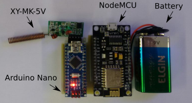

# Active RFID based telemetry system prototype

For this project my goal was to build an easy-to-implement telemetry system using mainly off the shelf hardware and software solutions. The *sensor node+database+visualization tool* pattern has became very common for IoT systems. Therefore, I wanted to play a little bit with putting together a complete system from data capture to visualization. Moreover, being an Electronics Engineer with experience developing hardware, that was a good opportunity to play with the *web* side of the project. The blocks on the right of the Figure 1.

<p align="center">
  <br>
  Figure 1: Block diagram of the complete system
</p>

The whole system uses technologies available for quickly developing a MVP solution. In short words, the system can be described by: sensor nodes made with arduino modules, a gateway based on nodeMCU (ESP8266) and arduino modules. that has access to the internet. After this point, I am in previously unknown waters. The gateway than communicates with an MQTT broker hosted on Heroku that hands the messages to a set of Docker containers. A very used set of containers are used in this application: Telegraf+InfluxDB+Grafana. Respectively, a bridge from MQTT to the database and a data visualization tool is used to create a custom dashboard.

The web side of the system is very well known, and one can find many resources on how to set up such system reliably for both prototyping and production. Thus, I will keep my focus on the hardware.

## Sensor node

The important requisites a sensor node could benefit of are the sensor capturing the data, range of communication and battery autonomy. An intended final product would probably look something like the Figure 2, below. With a single board, coin cell battery, printed antenna and a good enclosure.

<p align="center">
  <br>
  Figure 2: Possible final product sensor node model 
</p>

For the prototype, though, I wanted to use modules and connect them properly so that we can get the functionality right. So, the prototype sensor node was powered by a 9V battery (I didn't want to have problems with the battery dying) and comprised of:

* MCU: Arduino Nano
* Radio: Transmitter FS1000A ASK 434MHz with antenna
* Sensor: Temperature LM35

The modules were connected using a PCB that was milled locally, just like its shown on Figure 3. The connections were very straight-forward. The 9V **battery** to **Arduino** Vin and the **radio** had three pins, the power supply connected to Vin and GND and the analog data pin, labeled ATAD on the radio, connected to Arduino P~11. The  **LM35** power supply is connected to Arduino Vin and GNC and the data pin is connected to A0.

<p align="center">
  <br>
  Figure 3: Sensor node prototype
</p>

The firmware on the sensor node is very simple. To guarantee the good transmission of the data, it was used the RadioHead ASK library. It is very simple to use, you just import the library and send an `uint8_t` pointer to the message buffer and the buffer length. It is obviously not the best way to implement the system, mainly because while the Arduino is executing the command `delay(2000)`, it is not in a sleep mode. That will cause the system to spend a lot more energy, since tipically the sensor will be "on" for ~200ms and "off" the remaining time. The firmware used on the sensor node is almost self explanatory and is shown below with comments.

```Arduino
#include <RH_ASK.h>
#include <SPI.h> // Not actually used but needed to compile

RH_ASK driver;
char msg[12]; // buffer for the message that will be sent
char idx[6] = "#S01T"; // header to indicate which sensor

void setup(){
    Serial.begin(9600);   // Debugging only
    if (!driver.init())  // One has to wait the library initialize
         Serial.println("init failed"); // Debugging message
    Serial.println("init SUCCESS");
}

void loop(){
    sprintf(msg,"%s.%04d",idx,analogRead(A0)); // Read the data from LM35 and and append
    driver.send((uint8_t *)msg, strlen(msg)); // Send the data
    driver.waitPacketSent();
    delay(2000);
}
```

## Gateway

The important requisites the gateway could benefid of are a good connectivity with internet and a compatible radio interface with the radio specified for the sensor node. For such part of the system, it could be powered directly by an outlet and wouldn't have strong physical size limitations. With a larger enclosure, one could use multiple boards or integrate everything into a single one. A first model of the gateway using battery is shown in the Figure 4, below.

<p align="center">
  <br>
   Figure 4: Possible final product gateway model
</p>

For the prototype, I wanted to use WiFi to connect to a local internet connected network and I used a 9V battery to make the system easier to carry from school, work, home when needed. Even though the MCU I chose to use was compatible with the radio, it didn't have support for the RadioHead library I was using. Thus, to make the system symetric in terms of the radio. I had to use an Arduino Nano to interface with the radio and serially send the data to the main MCU. Being so, the used components were:

* MCU: NodeMCU v3 (ESO8266)
* Bridge: Arduino Uno
* Radio: Receiver XY-MK-5V ASK 433MHz with antenna
  
The modules were connected using a PCB that was milled locally, just like its shown on Figure 5. The connections are also very simple. The battery connects to the power supply of the **Arduino** and **NodeMCU**. And the **radio** is fed off of the Arduino 5V regulated power supply. The radio DATA connects to the Arduino AO and (This is important) the **Arduino TX pin connects through a 1/3 voltage divider to the NodeMCU RX**.

<p align="center">
  <br>
  Figure 5: Gateway prototype
</p>

The arduino bridge firmware is very similar to the sensor node, it just reads the data that comes from the radio and forwards it blindly to the NodeMCU. The commented code is shown below.

```Arduino
#include <RH_ASK.h>
#include <SPI.h> // Not actualy used but needed to compile
RH_ASK driver;
uint8_t buf[12];
uint8_t buflen = sizeof(buf);

void setup(){
    Serial.begin(115200); // Debugging only
    if (!driver.init()) // wait for library initialize
    	Serial.println("init failed"); // Debugging message
}

void loop(){
    if (driver.recv(buf, &buflen)) // Non-blocking
      Serial.println((char*)buf); // Forwared the message
}
```

For the NodeMCU itself, the firmware has a few new things to make it able to publish data to the MQTT broker. To do so, it was used the PubSubClient library. This code gets mode complicated, but the main important things you may have to pay attention to is the `ssid` and `passowrd` of the Wi-Fi network your NodeMCU is supposed to connect to, and the mqtt broker information: the `mqtt_server`, `mqtt_port`, `mqtt_username` and `mqtt_password`. Apart from that, the code has basic boilerplate for the MQTT stuff and inside the `loop`, the NodeMCU reads over the SoftwareSerial what is being sent by the Arduino and publishes it to the appropriate path on the mqtt broker. I don't want to go too deep into the web stuff. At the end of the page I will leave links to tutorials on those topics if you are interested.

```Arduino
#include <ESP8266WiFi.h>
#include <PubSubClient.h>
#include <SoftwareSerial.h>

#define D7 13
#define D8 15
SoftwareSerial mySerial(D7, D8); // RX = D7, TX  = D8
const char* ssid = "XT1069";
const char* password = "*******";
const char* mqtt_server = "m14.cloudmqtt.com"; /// MQTT Broker
int mqtt_port = 17078;
char msg[15];
const char* mqtt_username = "mmxjuyfz";
const char* mqtt_password = "*******";
WiFiClient espClient;
PubSubClient client(espClient);

void setup() {
  // put your setup code here, to run once:
  Serial.begin(115200);
  mySerial.begin(115200);
  pinMode(D7,INPUT); //d7 is RX, receiver, so define it as input
  pinMode(D8,OUTPUT); //d8 is TX, transmitter, so define it as output
  delay(10);
  Serial.println();
  Serial.print("Connecting to ");
  Serial.println(ssid);
 
  WiFi.begin(ssid, password);
 
  while (WiFi.status() != WL_CONNECTED) {
    delay(500);
    Serial.print(".");
  }
 
  Serial.println("");
  Serial.println("WiFi connected");
  Serial.println("IP address: ");
  Serial.println(WiFi.localIP());
 
  client.setServer(mqtt_server, mqtt_port);
  client.setCallback(callback);
  
  Serial.println("Connected ");
  Serial.print("MQTT Server ");
  Serial.print(mqtt_server);
  Serial.print(":");
  Serial.println(String(mqtt_port)); 
  Serial.print("ESP8266 IP ");
  Serial.println(WiFi.localIP()); 
  Serial.println("GATEWAY Online");
}

void callback(char* topic, byte* payload, unsigned int length) {
  Serial.print("Message arrived [");
  Serial.print(topic);
  Serial.print("] ");
  for (int i = 0; i < length; i++) {
    Serial.print((char)payload[i]);
  }
  Serial.println();
}

void reconnect() {
  // Loop until reconnect
  while (!client.connected()) {
    Serial.print("Attempting MQTT connection...");
  // Attempt to connect
    if (client.connect("ESP8266Client", mqtt_username, mqtt_password)) {
      Serial.println("connected");
    // client.subscribe("event");
    } else {
      Serial.print("failed, rc=");
      Serial.print(client.state());
      Serial.println(" try again in 5 seconds");
      // Wait 5 seconds before retrying
      delay(5000);
   }
 }
}

void loop() {
   if (!client.connected())
      reconnect();

   while(mySerial.available() > 0){ // put your main code here, to run repeatedly:
    if(mySerial.read() == 35){ 
     mySerial.readStringUntil('\n').toCharArray(msg,15);
     Serial.println(msg);
     delay(100);
     if(client.publish("rbp/ifsc/sensor", msg, true))
      Serial.println("Publish ok");
    }
   }
   client.loop();
   delay(1000);
}
```

## Web Services

For the service part of the project it was used a **Heroku** dyno as the MQTT broker, so that we could have the sensors and the rest of the system running in different LANs (for easy demonstration). The rest of the services used a selection of **Docker** containers with standard configuration that werw organized by a *docker-compose.yml* file.

* MQTT broker: CloudMQTT hosted at Heroku
* Application: Telegraf - a plugin-driven server agent for collecting and reporting metrics (container: telegraf:latest)
* Database: InfluxDB - atime series database (container: influxdb:latest)
* Data Visualization: Grafana - open platform for analytics and monitoring (container: grafana/grafana:latest)

Since the focus of this page is not the web part of the project I will indicate you the following materials on the missing parts.

* [What are Docker, containers, docker-compose?](https://medium.com/peaksware-product-development/understanding-docker-and-docker-compose-5f1b63d6ec0a)
* [Heroku](https://www.heroku.com/) - [CloudMQTT](https://devcenter.heroku.com/articles/cloudmqtt)
* [Telegraf+InfluxDB+Grafana](https://angristan.xyz/monitoring-telegraf-influxdb-grafana/)

## Conclusion

I may dedicate some extra time to get into the Web Services once I get more familiar and feel more confortable explaining those concepts myself. But, thats for something for another time. For now, all files necessary to reproduce this project are at the [GitHub repository](https://github.com/rafaelbidese/rfid-telemetry).

A last unmentioned keypoint of the project is that all nodes are simplex, meaning that they only broadcast information. Moreover, those messages are unencrypted and have no anti-colision. Though, since the nodes only send data out every couple seconds, even if the data collide its not too big of a deal, considering that by not having a receiver on the sensor node, the battery can last way longer.

The data collected by the system monitoring the temperature of the laboratory I used to work is shown using the Grafana dashboard as can be seen at the Figure 6. In the first hours, the WiFi lost connectivity to with the internet a few times. Hence, the areas on the graph without measurements. Though, it took me less than a month to get everything together and working properly.

<p align="center">
  <br>
  Figure 6: Dashboard monitoring temperature
</p>

I am writing this one year after I have finished the project. That may have caused me to forget some details of the implementation, if you have any questions please do not hesitate to reach out to me.
