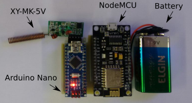

# Gateway

  

- **XY-MK-5V:** 433MHz radio receiver
- **Arduino Nano:** radio bridge
- **Firmware:**  RadioHead ASK lib + bridge
- **NodeMCU:** microcontrolling unit with WiFi capability (ESP8266)

- **Firmware:** PubSubClient (MQTT Client)

## Wiring

**Arduino Nano -> XY-MK-5V**

A0 -> DATA
5V -> VCC
GND -> GND

**NodeMCU -> Battery**

Vin -> 9V

**NodeMCU -> Arduino Nano**

RX -> (voltage divider) -> TX
Vin -> 5V